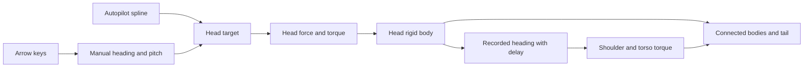

# How it works

## Simplify and group the printed model

Biocraftlab’s Elder Fire STL contains 1,285,002 triangles in 86 disconnected shells. [prepare-elder-fire.py](../scripts/prepare-elder-fire.py) verifies the source hash, simplifies each shell separately, and groups ten axial sections and their decorations into seven centred meshes. The result retains 120,106 triangles across about 6 MB of STL files. Coordinates change from Z-up to Y-up and are scaled by 0.052. The component mapping, anchors, and offsets are specific to this model.

The rigid groups are head, shoulders and wings, torso, hind legs, tail base, tail middle, and tail tip. Wings stay fixed in their printed pose, avoiding a new wing rig. Six spherical joints join them. The neck permits roughly ±69° of twist and a 66° swing cone; its local twist axis is aligned with world up in the initial pose.

Rendered meshes and collision shapes serve different purposes. Compact convex proxies handle ground contact. Separate zero-density wing hulls provide floor contact without giving the broad wings an oversized torso mass. Additional zero-density compound hulls enclose the head and the feet so those parts can collide without adding mass. Collision masks disable other self-collision pairs so the printed interlocking joints do not jam.

## Head-led flight

[flight-path.js](../src/flight-path.js) constructs a closed centripetal Catmull–Rom spline and samples it with `getPointAt` and `getTangentAt`. An arc-length lookup with 600 divisions approximates distance along the circuit. The nominal speed is 6.8 scene units per second, adjusted by the tangent's vertical component. Entry blends over three seconds. Tangent change supplies banking, clamped to 0.65 radians.

The head receives a position/velocity error force plus gravity compensation, with a force limit. Its orientation is controlled by a quaternion-error torque. Shoulder and torso torques use the recorded head attitude after 0.3 and 0.4 seconds. Their positions are pulled through the joints. Additional manual neck exaggeration is removed from the heading history so the whole torso does not copy it.

The other sections retain 18% of normal gravity during flight. Softer joint springs and tail target rotations help the curled printed tail unfold. There is no tail position target and no wing-flapping animation.

## Manual steering and handoff

Arrow input immediately creates a [manual controller](../src/manual-flight.js) from the current head state. Left/right changes heading; up/down changes pitch. The visible neck also looks into turns and lifts its chin, both as an input indicator and to clear the front feet. The virtual head target stays within 1.5 units of the physical head to avoid accumulating excessive force.

After five seconds without steering, the autopilot starts a new circuit oriented to the current heading. It blends from current position and velocity. Holding or repeating an arrow restarts the timer. Simulation pause and a hidden tab stop the timer.

## Grabbing, landing, and time

Grabbing creates a temporary kinematic body and a damped distance spring (5 Hz for heavier sections, rising to at most 14 Hz for the light tail) to the local point that was clicked. The pointer moves on a camera-facing plane. Handle speed is capped at 30 units per second and spring force is bounded. Targets use world coordinates, allowing grabs far from the starting circle. Release removes the joint without zeroing velocity.

The application accumulates time into fixed 1/60-second steps. Each step runs two controller/collision updates, or four while grabbing, with six Box3D solver substeps per update. A hidden tab does not accumulate catch-up time.

Nine floor tiles move with the flight area. Floor impacts use restitution; a solid head/body hit above the impact threshold ends lift and returns to full gravity. Tail grazes can bump without ending flight. The UI shows **BUMP!**, then **FALLING** or **AT REST** according to the bodies' sleep state.

## Rendering and interaction polish

[main.js](../src/main.js) loads the part STLs, merges coincident render vertices, and recomputes normals. Three.js physical materials distinguish translucent Jade, metallic Copper, and softer Obsidian. Picking highlights the selected material's own colour. Contact shadows darken and tighten near the floor, alongside a moving shadow-casting light.

Reset fades the canvas out, resets physics and camera while hidden, then fades back in over half a second. Reduced-motion preferences shorten the transition. Other motion controls are held during reset.

## Limits

- This is tuned procedural flight, not aerodynamics. Lift, reduced gravity, and orientation assistance are deliberate artistic controls.
- The wings are deliberately grouped with the shoulders; this adaptation does not animate their printed joints.
- Collision hulls approximate surfaces; head/foot collision is targeted, not complete mesh-to-mesh self-collision.
- Preparation is specific to the reference STL. An arbitrary dragon file will need different component mapping and anchors.
- WebGL2 and WebAssembly SIMD are required. The single-threaded WASM build needs no cross-origin isolation headers.
- The page requests its two fonts from Google Fonts; the simulation itself runs in the browser.
